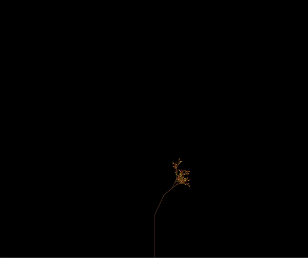

### L-System Renderer

This is a simple renderer for a l-system like grammar built on top of p5.js. I am hoping I'll get to documenting more of the process soon, for now - there are some examples in the `sample_lsystems/` folder.

Dark Cherry Blossom       |  
:-------------------------:|
  |